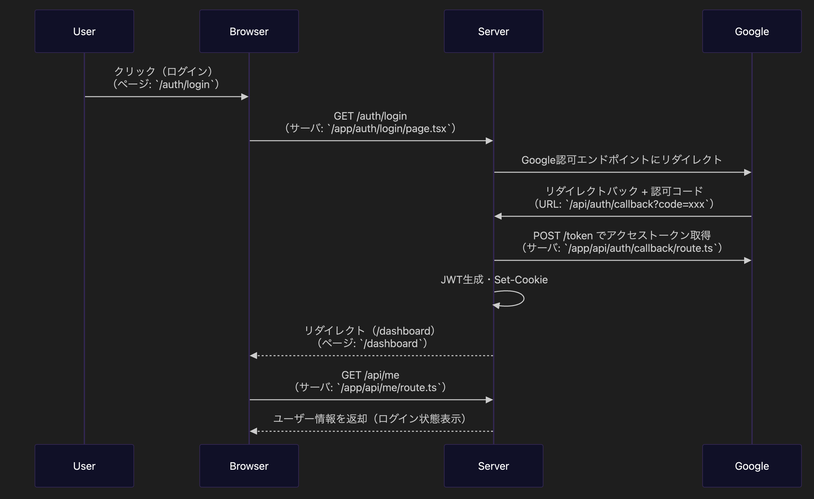

# 🔐 Login App - Next.js + JWT 認証

このアプリは、Next.js（App Router）で構築された**シンプルなJWTログインアプリ**です。  
フロントエンドとバックエンドを統合した**BFF構成**で、認証状態の保持やログイン後の画面切り替えを実装しています。

---

## 🚀 デモ

- [アプリURL](https://login-app-murex-kappa.vercel.app/)
- [GitHubリポジトリ](https://github.com/repon/login-app-202504141643)

---

## シーケンス図

以下は、ログイン処理の概要フローです：



---

## ⚙️ 使用技術・構成

| 分類           | 内容                        |
| -------------- | --------------------------- |
| フレームワーク | Next.js（App Router）       |
| 言語           | TypeScript                  |
| 認証           | JWT（自前実装、Cookie保存） |
| デプロイ       | Vercel（フロント）          |

---

## ✨ 実装ポイント・工夫点

- **JWT認証とCookieの連携**：
  - `HttpOnly` CookieにJWTを保存して、セキュアなログインを実現
- **`/api/me`によるユーザー状態取得**：
  - ページ描画時に認証状態をチェックし、ログイン後の表示を制御
- **middleware.ts** によるルートアクセス制御（未認証なら /auth/login へ）
- **useAuth()** によるクライアント側の状態管理と表示切り替え
- **Tailwind CSS** による簡潔なUI構築

---

## 📦 セットアップ手順

```bash
git clone https://github.com/repon/login-app-202504141643
cd login-app
cp .env.example .env
npm install
npm run dev
```

---

## 📁 .env 設定例

```env
# ✅ Google OAuth 認証に必要（Google Cloud Console で取得）
GOOGLE_CLIENT_ID=
GOOGLE_CLIENT_SECRET=

# ✅ アプリのベースURL（Vercelデプロイ時は本番URLに）
NODE_ENV=development
NEXT_PUBLIC_APP_URL=http://localhost:3000
APP_URL=http://localhost:3000
```

---

## 🧪 今後の拡張予定

- [ ] Prisma + Railway によるDB連携構成（`prisma` ブランチにて開発中）
- [ ] ユーザー登録・プロフィール編集
- [ ] RBAC（ロールベースアクセス制御）
- [ ] パスワードリセット
- [ ] 通知機能の追加
- [ ] テスト（supertest / vitest）導入

---

## 🧑‍💻 作者について

- フロントエンドエンジニア歴5年（Vue, React）
- 要件定義・API設計から実装・運用まで一貫対応
- [Twitter](https://x.com/ha20250121)
- ポートフォリオ: [Github プロフィールページ](https://github.com/repon)
